# **Mathematics Foundation to Computer Science - I**

## 📌 Table of Contents
- [Types of Matrices](#types-of-matrices)
  - [📌 Square Matrix](#square-matrix)
  - [📌 Row Matrix](#row-matrix)
  - [📌 Column Matrix](#column-matrix)
  - [📌 Diagonal Matrix](#diagonal-matrix)
  - [📌 Scalar Matrix](#scalar-matrix)
  - [📌 Identity Matrix](#identity-matrix)
  - [📌 Zero (Null) Matrix](#zero-null-matrix)
  - [📌 Upper & Lower Triangular Matrices](#upper--lower-triangular-matrices)
  - [📌 Symmetric & Skew-Symmetric Matrices](#symmetric--skew-symmetric-matrices)
  - [📌 Orthogonal Matrix](#orthogonal-matrix)
- [Algebra of Matrices](#algebra-of-matrices)
  - [➕ Addition of Matrices](#addition-of-matrices)
  - [➖ Subtraction of Matrices](#subtraction-of-matrices)
  - [✖️ Multiplication of Matrices](#multiplication-of-matrices)
- [📌 Determinant of a Matrix](#determinant-of-a-matrix)
- [📌 Symmetric and Skew-Symmetric Matrices](#symmetric-and-skew-symmetric-matrices)
- [📌 Orthogonal Matrix](#orthogonal-matrix-title)
- [📌 Inverse of a Matrix](#inverse-of-a-matrix)

---

## 🟢 **Types of Matrices**

### 📌 Square Matrix
A **square matrix** is a matrix where the number of rows is equal to the number of columns. That means if a matrix has **n rows** and **n columns**, it is called an **𝑛 × 𝑛 square matrix**.

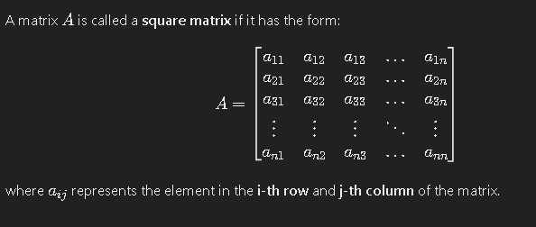

#### **Properties of a Square Matrix**
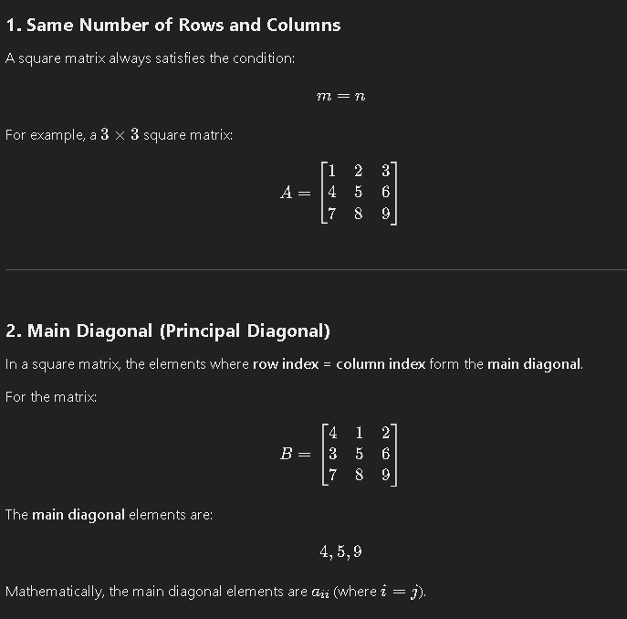
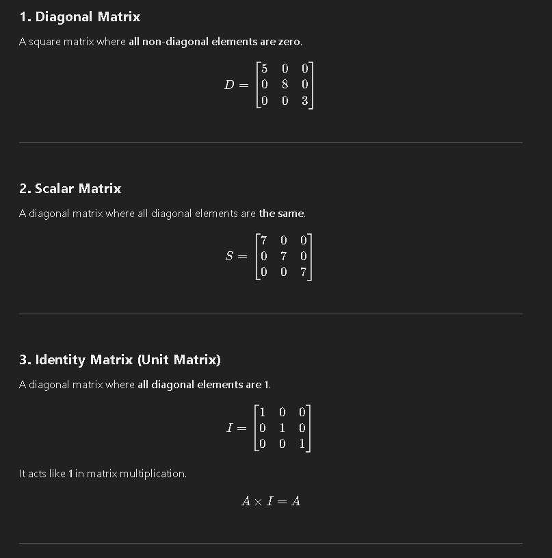

---

### 📌 Row Matrix
A **row matrix** is a matrix that contains only **one row** and can have any number of columns. It is also referred to as a **row vector**.

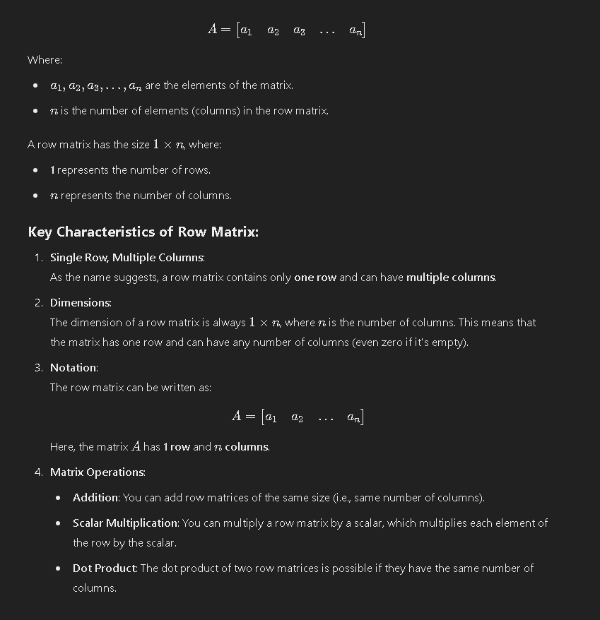

---

### 📌 Column Matrix
A **column matrix** consists of only **one column** and multiple rows. It is often referred to as a **column vector** and has dimensions **𝑚 × 1**.

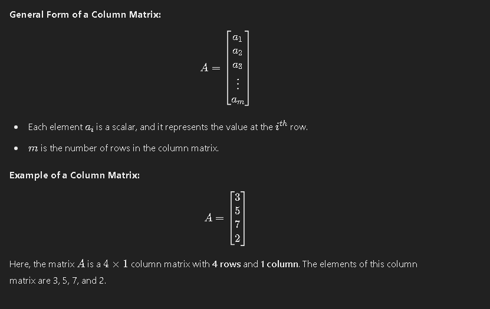

#### **Properties of a Column Matrix**
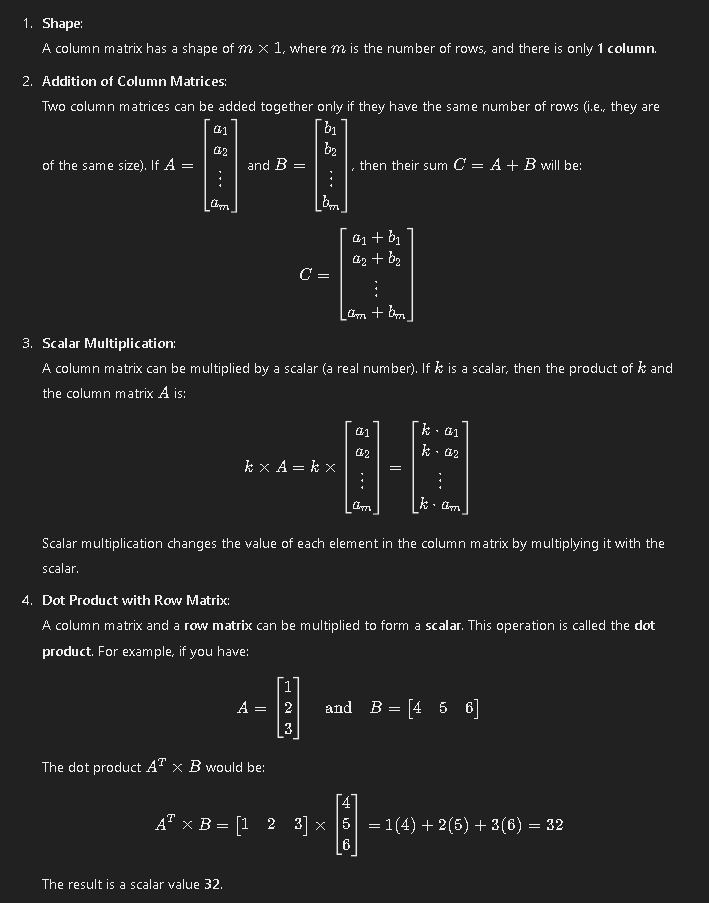

---

### 📌 Diagonal Matrix
A **diagonal matrix** is a square matrix in which all **non-diagonal elements** are zero.

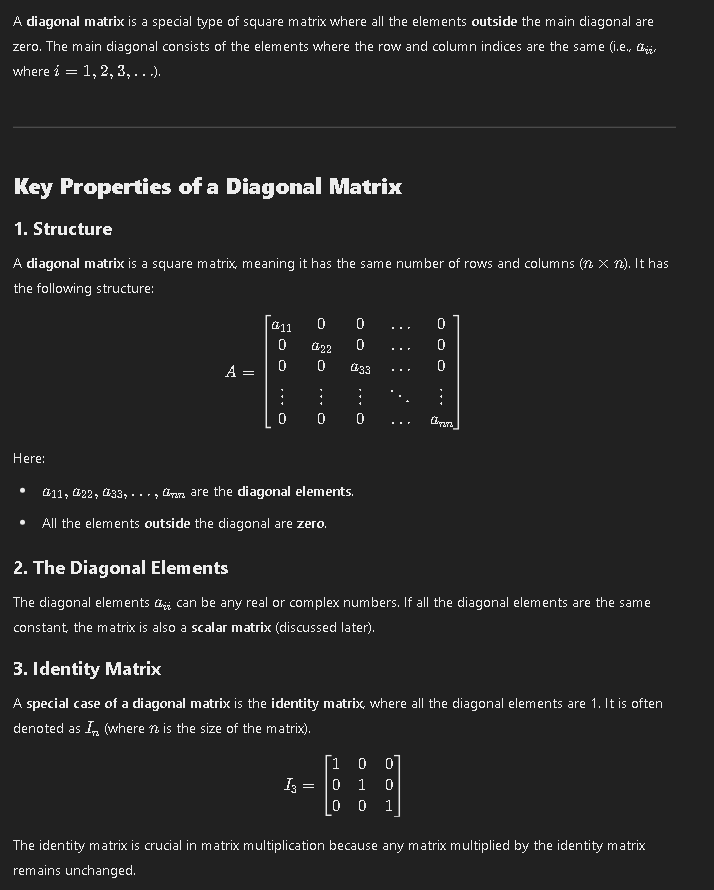

#### **Properties of Diagonal Matrices**
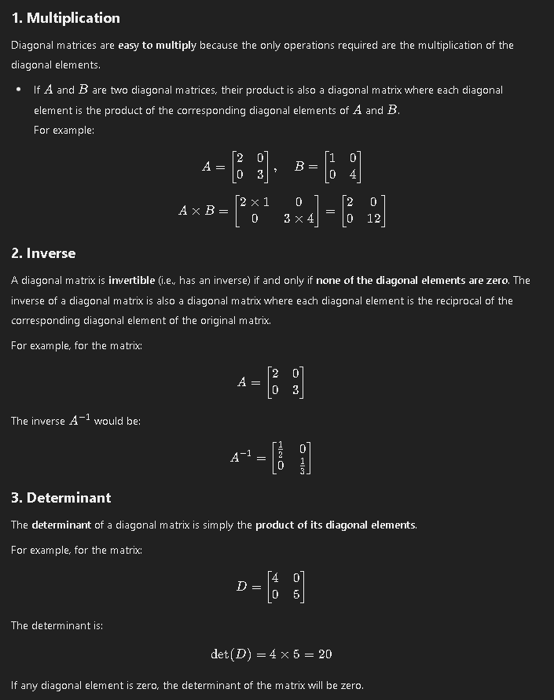

---

### 📌 Scalar Matrix
A **scalar matrix** is a **diagonal matrix** where all diagonal elements are equal.

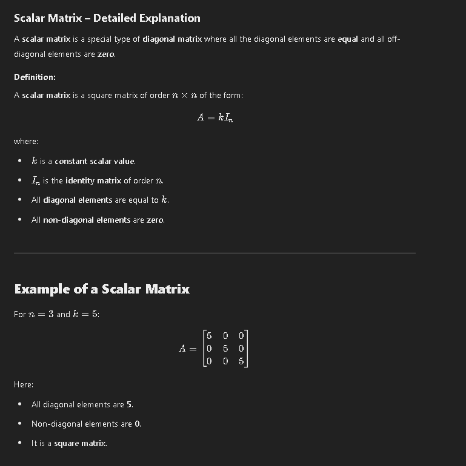

---

### 📌 Identity Matrix
An **identity matrix** is a square matrix where all the **diagonal elements** are **1**, and the rest are **0**.

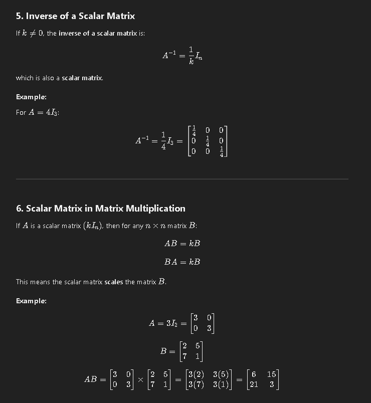

---

### 📌 Zero (Null) Matrix
A **zero matrix** (or **null matrix**) is a matrix where all elements are **0**.

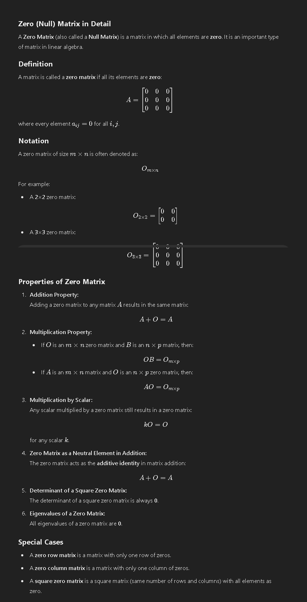

---

### 📌 Upper & Lower Triangular Matrices
An **upper triangular matrix** has all elements below the main diagonal as **0**, while a **lower triangular matrix** has all elements above the main diagonal as **0**.

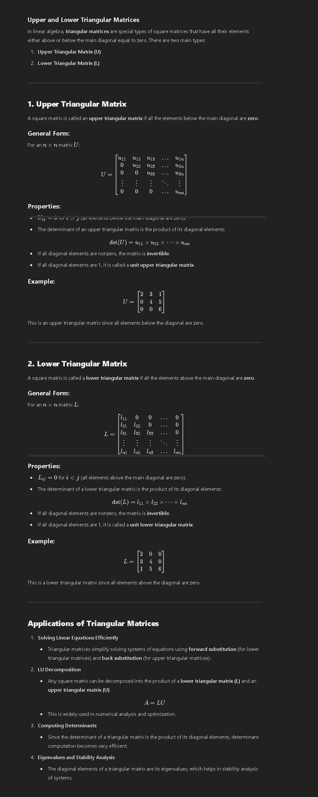

---

### 📌 Symmetric & Skew-Symmetric Matrices
A **symmetric matrix** satisfies \( A = A^T \), whereas a **skew-symmetric matrix** satisfies \( A = -A^T \).

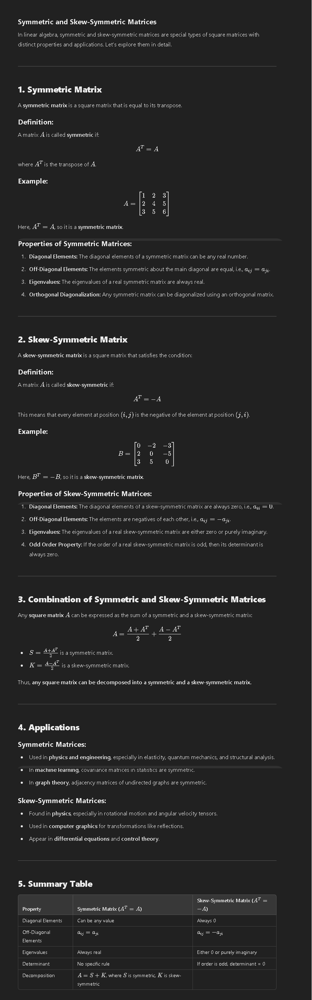

---

### 📌 Orthogonal Matrix
A **matrix A** is called **orthogonal** if \( A^T A = I \), where **I** is the identity matrix.

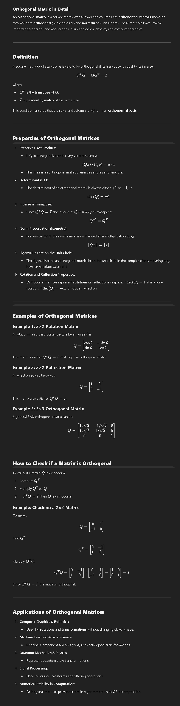

---

## 🔢 **Algebra of Matrices**

### ➕ **Addition of Matrices**
Matrix addition is performed by adding corresponding elements.

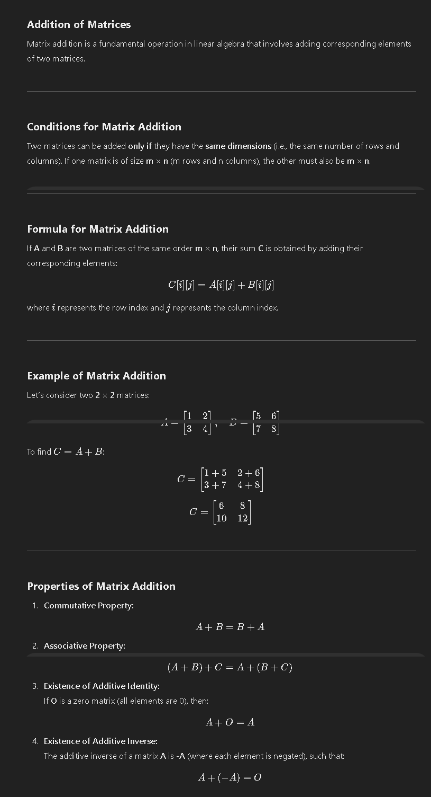

---

### ➖ **Subtraction of Matrices**
Matrix subtraction is performed by subtracting corresponding elements.

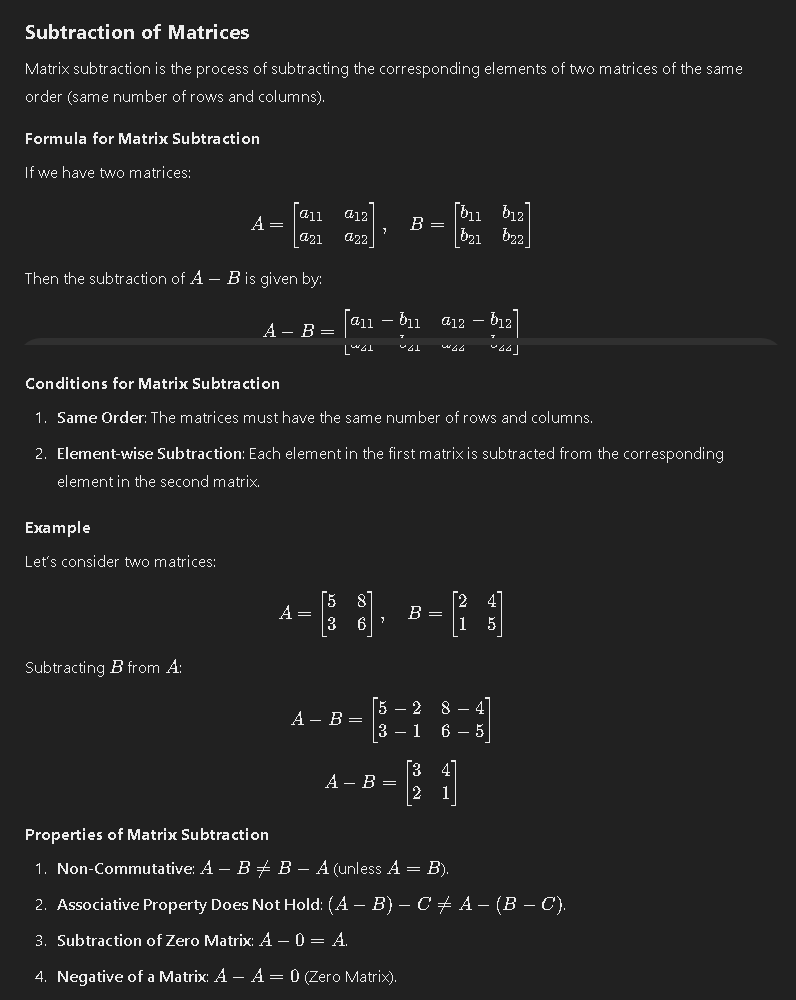

---

### ✖️ **Multiplication of Matrices**
Matrix multiplication is performed by taking the **dot product** of rows and columns.

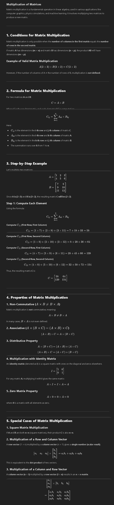

---

## 🔢 **Determinant of a Matrix**
The **determinant** of a square matrix is a special number that describes its properties.

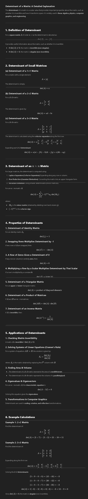

---

## 🔢 **Symmetric and Skew-Symmetric Matrices**
A **symmetric matrix** satisfies \( A = A^T \), while a **skew-symmetric matrix** satisfies \( A = -A^T \).

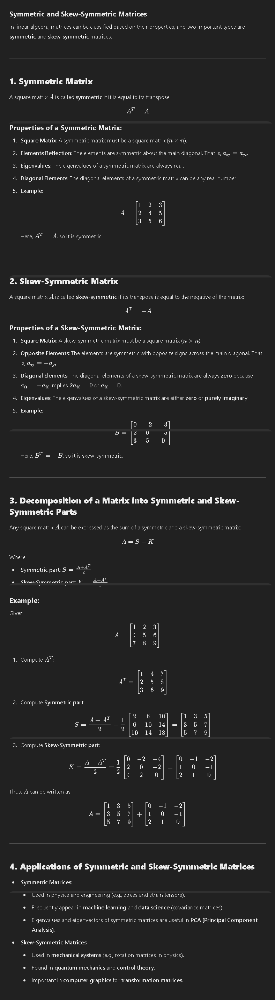

---

## 🔢 **Orthogonal Matrix**
A matrix is **orthogonal** if its **transpose** is equal to its **inverse**.

---

## 🔢 **Inverse of a Matrix**
A **matrix A** has an inverse **\( A^{-1} \)** if and only if its determinant is **non-zero**.

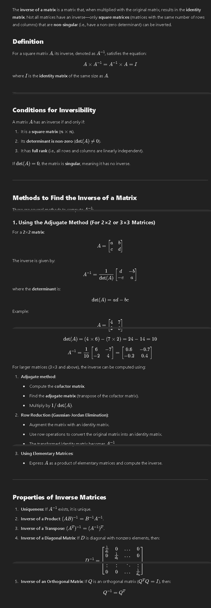

---

> 📝 **Note:** Understanding matrices is essential in various fields of **computer science**, including **machine learning, graphics, and algorithms**.

🚀 *Keep Practicing!* 🎯
