# MATHEMATICS FOUNDATION TO COMPUTER SCIENCE - I

- [MATHEMATICS FOUNDATION TO COMPUTER SCIENCE - I](#mathematics-foundation-to-computer-science---i)
  - [Types of Matrices](#types-of-matrices)
    - [Square Matrix](#square-matrix)
    - [Row Matrix](#row-matrix)
    - [Column Matrix](#column-matrix)
    - [Diagonal Matrix](#diagonal-matrix)
    - [Scalar Matrix](#scalar-matrix)
    - [Identity Matrix](#identity-matrix)
    - [Zero (Null) Matrix](#zero-null-matrix)
    - [Upper \& Lower Triangular Matrices](#upper--lower-triangular-matrices)
    - [Symmetric \& Skew-Symmetric Matrices](#symmetric--skew-symmetric-matrices)
    - [Orthogonal Matrix](#orthogonal-matrix)
  - [Algebra of Matrices](#algebra-of-matrices)
    - [Addition of Matrices](#addition-of-matrices)
    - [Subtraction of Matrices](#subtraction-of-matrices)
    - [Multiplication of Matrices](#multiplication-of-matrices)
  - [Determinant of a Matrix](#determinant-of-a-matrix)
  - [Symmetric and Skew-Symmetric Matrices](#symmetric-and-skew-symmetric-matrices)
  - [Orthogonal Matrix (title)](#orthogonal-matrix-title)
  - [Inverse of a Matrix](#inverse-of-a-matrix)

## Types of Matrices

### Square Matrix

A square matrix is a matrix where the number of rows is equal to the number of columns. That means, if a matrix has n rows and n columns, it is called an 𝑛 × 𝑛 square matrix.

Properties of a Square Matrix

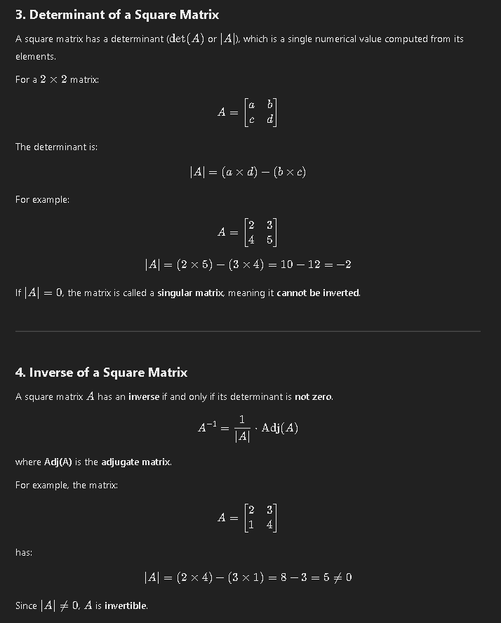
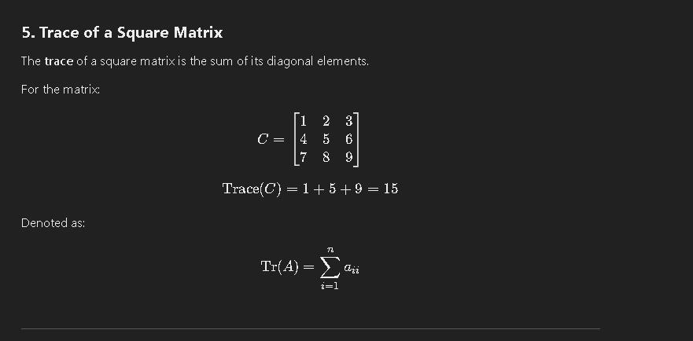

Types of Square Matrices

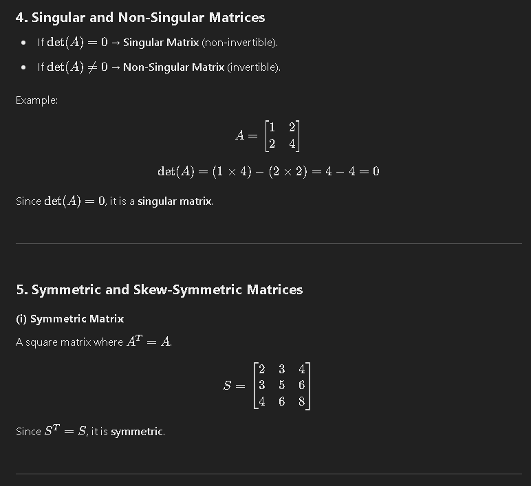
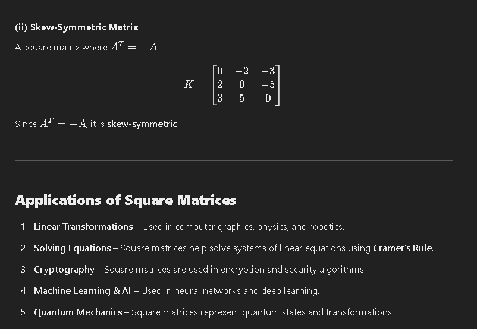

### Row Matrix

A row matrix is a type of matrix that contains only one row and can have any number of columns. It is also referred to as a row vector. The row matrix is represented as a matrix with the general form

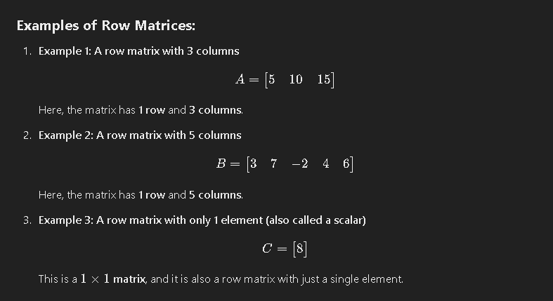
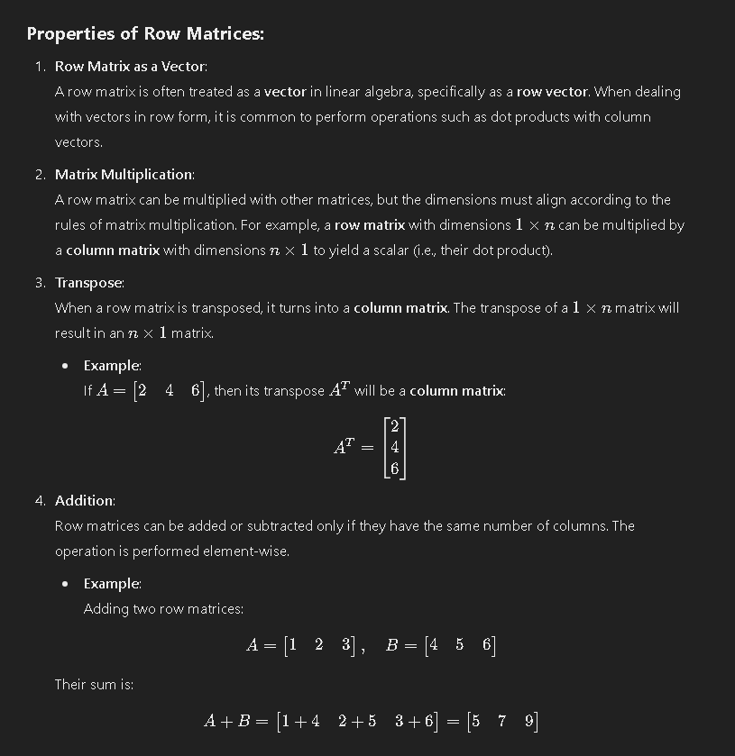
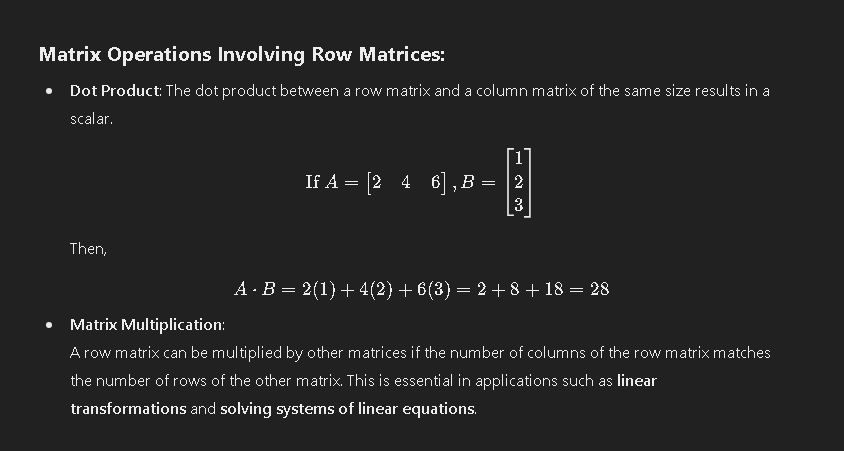

### Column Matrix

A column matrix is a type of matrix that consists of only one column and multiple rows. It is often referred to as a column vector because of its structure. Mathematically, it has dimensions of 𝑚 × 1, where 𝑚 represents the number of rows and 1 represents the number of columns.

Properties of a Column Matrix:

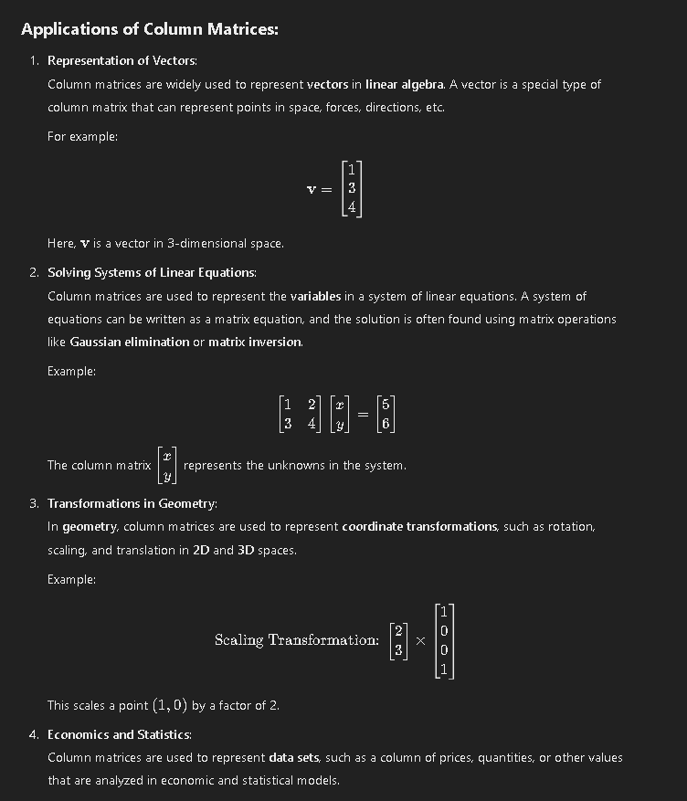

### Diagonal Matrix

Properties of Diagonal Matrices

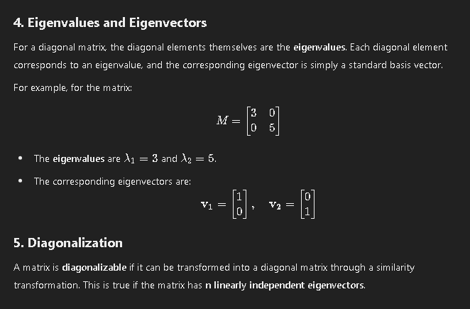
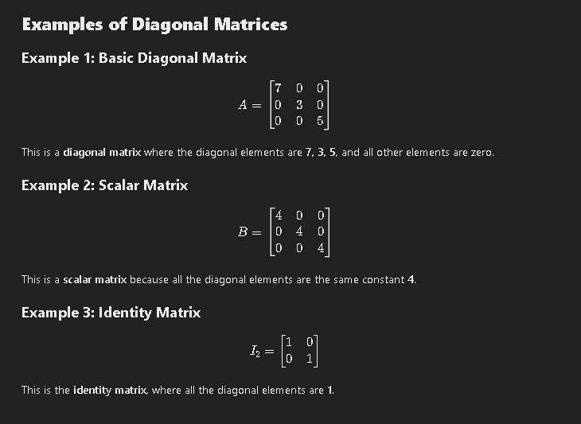

### Scalar Matrix

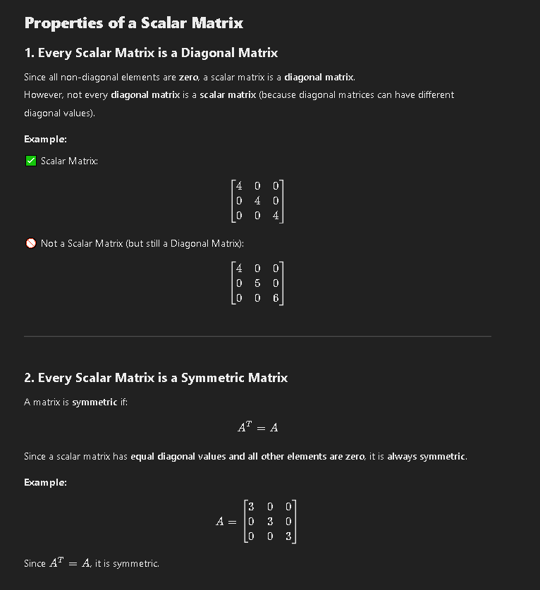
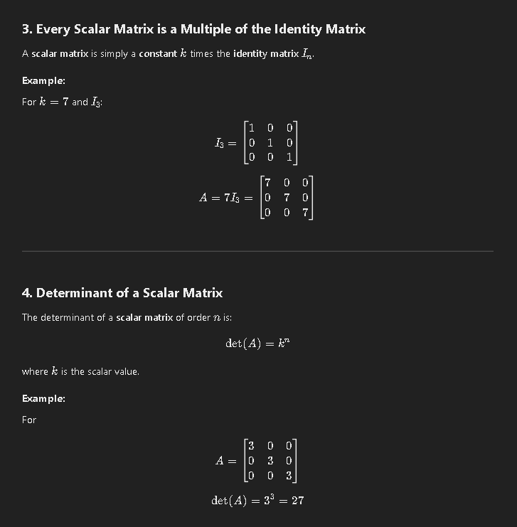

### Identity Matrix

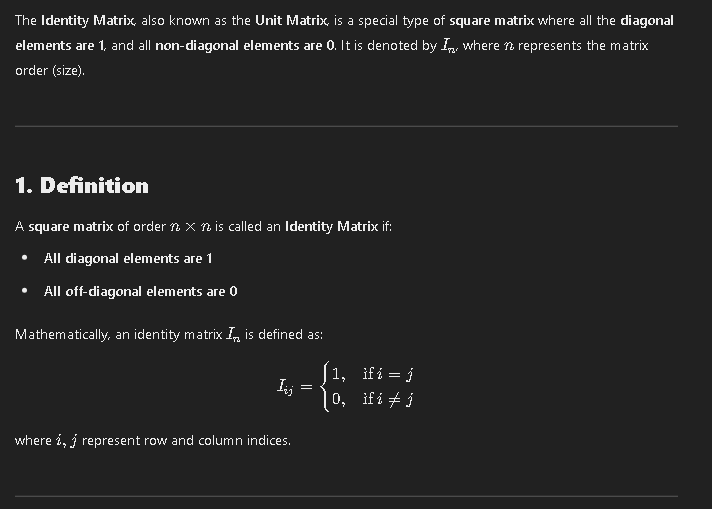
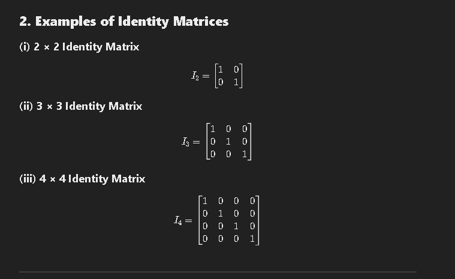
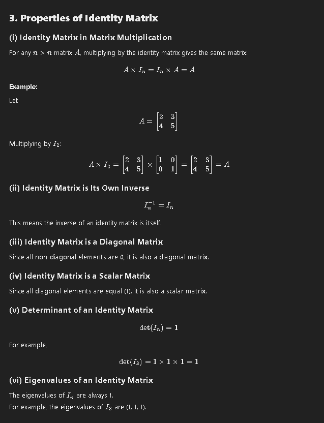

### Zero (Null) Matrix

### Upper & Lower Triangular Matrices

### Symmetric & Skew-Symmetric Matrices

### Orthogonal Matrix

## Algebra of Matrices

### Addition of Matrices

### Subtraction of Matrices

### Multiplication of Matrices

## Determinant of a Matrix

## Symmetric and Skew-Symmetric Matrices

## Orthogonal Matrix (title)

## Inverse of a Matrix

